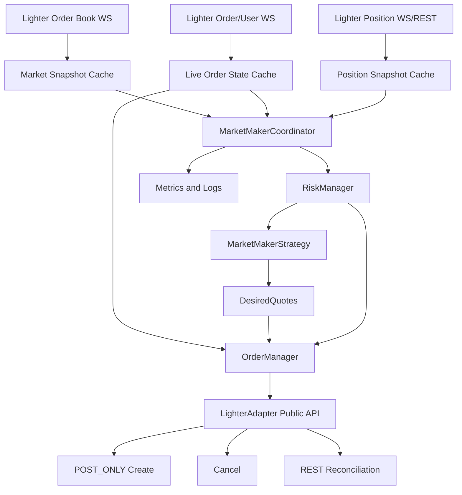
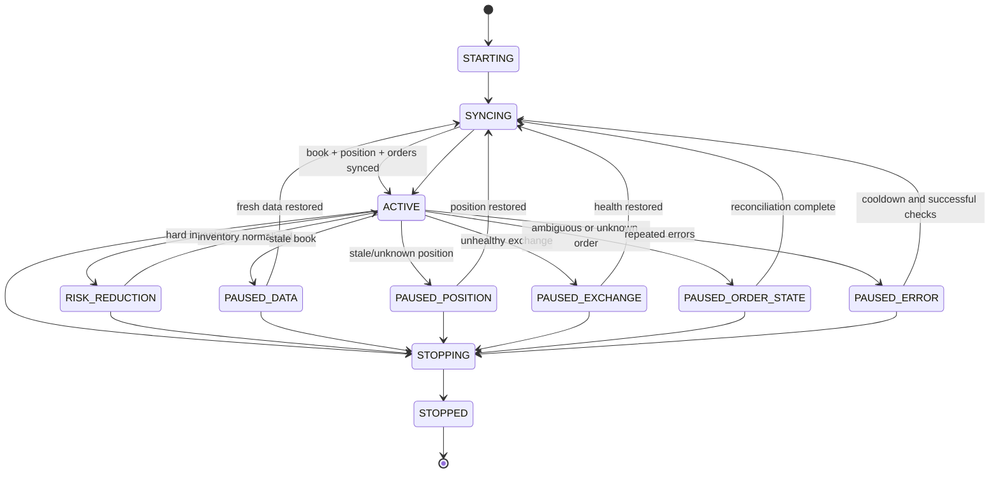

# Grid-Tradexyz-Extension：最小可行做市商策略實作 Pipeline

> 文件用途：提供給 Codex 作為實作規格、工作順序、測試要求與驗收標準。  
> 目標 Repository：`zhichen-v/Grid-Tradexyz-Extension`  
> 主要執行市場：Lighter 永續合約訂單簿市場  
> 主要語言與執行環境：Python 3.12、`asyncio`、現有 Lighter SDK 與 Exchange Adapter  
> 文件定位：MVP 工程計畫，不是完整高頻做市模型，也不是獲利保證或積分保證。

---

## 1. 任務摘要

在不破壞既有網格交易系統的前提下，新增一個獨立、低資源、可測試、可安全停止的最小可行 Market Maker 模組。

MVP 必須完成以下能力：

1. 只操作一個 Lighter 交易對。
2. 正常狀態下只維持一張 Bid 與一張 Ask。
3. 所有一般報價均使用 `POST_ONLY` 限價單。
4. 以訂單簿最佳買賣價計算參考中間價。
5. 使用固定基礎價差，加上庫存偏移 `inventory skew`。
6. 根據目前持倉與尚未成交訂單計算最壞曝險。
7. 接近持倉上限時降低或停用增加風險的一側。
8. 達到硬風控區時，只允許減倉方向的 `reduce_only` 報價。
9. 市場資料過期、持倉資料不可信、WebSocket 不健康或訂單狀態不確定時，採取 fail-closed：停止新增訂單，並撤除可確認的既有報價。
10. 對下單結果不確定與取消結果不確定的情況，禁止盲目重試，先進行 reconciliation。
11. 支援 `dry_run`，在完全不送出任何交易 mutation 的狀態下執行完整決策流程。
12. 保留既有 Grid、Volume Maker、Exchange Adapter 與測試的相容性。

---

## 2. 現有 Repository 判讀

Codex 在修改前必須先確認下列現況，並以實際程式碼為準，不得只依賴本文件的描述。

### 2.1 可以直接沿用的基礎層

現有 Repository 已包含：

- `core/adapters/exchanges/interface.py`
  - 統一的交易所介面。
  - 已涵蓋行情、訂單簿、持倉、下單、撤單與訂單查詢等功能。
- `core/adapters/exchanges/adapters/lighter.py`
  - Lighter 的統一 Adapter。
  - 已封裝 REST 與 WebSocket。
  - 已提供 `get_orderbook`、`get_positions`、`get_open_orders`、`create_order`、`cancel_order`、`cancel_all_orders`、`subscribe_orderbook`、`subscribe_user_data`、`subscribe_positions`、`health_check`。
- `core/adapters/exchanges/adapters/lighter_rest.py`
  - 已處理動態價格與數量精度。
  - 已處理最小 base amount 與 quote amount。
  - 已有 rate-limit cooldown。
  - 已有 client order index 產生機制。
  - 已有 ambiguous submission 與 ambiguous cancellation 的 reconciliation 基礎。
- `core/adapters/exchanges/adapters/lighter_websocket.py`
  - 已有訂單簿、訂單、成交與持倉回調。
  - 已有重新連線與重新訂閱機制。
  - 已有 connection health 狀態。
- `core/services/grid/implementations/grid_engine_impl.py`
  - 可參考其訂單追蹤、WebSocket/REST fallback、in-flight mutation、停止流程與 Lighter `POST_ONLY` 用法。
- `tests/test_grid_lighter_post_only.py`
  - 已驗證 Lighter 限價單會帶入 `{"time_in_force": "POST_ONLY"}`。

### 2.2 不應直接改造成 Market Maker 的模組

以下模組只能作為工程經驗參考，不應直接改寫其核心語意：

- `core/services/grid/implementations/grid_strategy_impl.py`
  - 現行核心是「固定網格層級」與「成交後掛反向單」。
  - Market Maker 的核心應是「每個決策週期重新計算應存在的 Bid/Ask」。
- `core/services/grid/coordinator/grid_coordinator.py`
  - 可參考生命週期與監控方式，但不要在其中塞入 MM 分支。
- `core/services/volume_maker/`
  - 現有 Lighter Volume Maker 主要是市價開平倉循環。
  - 這與被動雙邊做市的風險模型不同。
  - 不得把該模組重新命名後當作 MM。
- `run_grid_trading.py`
  - 不應把 Market Maker 變成新的 `grid_type`。
  - MVP 應新增獨立 entrypoint，避免現有 Grid 啟動流程承擔兩種狀態模型。

### 2.3 既有 Grid 必須保持原行為

本任務預設：

- 不修改既有 Grid 成交後反向掛單規則。
- 不改變既有 Grid YAML schema。
- 不改變 `run_grid_trading.py` 的 CLI 行為。
- 不刪除既有 Volume Maker。
- 若確實需要抽取共用工具，必須先有 regression test，且 diff 應保持最小。

---

## 3. MVP 範圍

### 3.1 必做範圍

- Lighter perpetual。
- 單一交易對。
- 單一程序。
- 單一帳戶或專用 sub-account。
- 一層 Bid、一層 Ask。
- 固定基礎 spread。
- Inventory skew。
- Position soft limit、hard limit、absolute max limit。
- Order reconciliation。
- WebSocket 行情與訂單事件。
- REST 定期同步。
- Dry-run。
- 完整 unit test 與 mock integration test。
- Graceful shutdown。
- 結構化日誌與基本 metrics。

### 3.2 明確排除於 MVP

以下項目不得在第一版同時加入：

- Avellaneda–Stoikov。
- 機器學習或方向預測。
- 技術指標。
- Order book imbalance 或 microprice。
- 波動率動態 spread。
- 多層 order ladder。
- 多交易對。
- 跨交易所對沖。
- 現貨與期貨同時對沖。
- 自動市價強制平倉。
- 自動積分估算。
- 自成交、跨自有帳戶互相成交或任何形式的洗量。
- 資料庫與跨重啟訂單持久化。
- Web UI。
- 大規模重構現有 Adapter。

這些項目應放入 Post-MVP Roadmap，而不是混入第一個 PR。

---

## 4. 實作原則

Codex 必須遵守以下工程約束。

### 4.1 安全優先

所有不確定狀態一律採 fail-closed：

- 無法確認訂單簿新鮮度：不下單。
- 無法確認持倉：不下單。
- 無法確認取消完成：不掛替代單。
- 無法確認下單是否已進入交易所：不重送相同意圖。
- 發現未知訂單：預設停止，而不是猜測。
- 無法確認價格或數量精度：啟動失敗。
- 無法確認最壞曝險未超限：不送單。

### 4.2 不直接從策略層存取 Adapter 私有欄位

禁止：

```python
adapter._rest
adapter._websocket
```

策略層、風控層與 Order Manager 應只使用公開 Adapter API。

只有在現有公開 API 無法滿足必要功能時，才可：

1. 在 Lighter Adapter 新增一個最小公開方法。
2. 為該公開方法新增測試。
3. 不讓 Lighter SDK 型別洩漏到 Market Maker domain layer。

### 4.3 所有金融數值使用 Decimal

價格、數量、費率、spread、position、notional 必須使用：

```python
Decimal(str(value))
```

禁止在策略計算中使用 `float`。

`float` 只可用於：

- monotonic time。
- sleep duration。
- UI refresh interval。

### 4.4 Callback 不得直接執行下單或撤單

WebSocket callback 只允許：

1. 更新最新 snapshot。
2. 更新訂單狀態 cache。
3. 設定 `asyncio.Event`。
4. 快速返回。

實際 mutation 必須由單一 reconcile loop 執行，避免：

- 重複下單。
- callback storm。
- nonce 競爭。
- cancel/place race。
- 同時存在多個 reconcile cycle。

### 4.5 不新增外部依賴

MVP 使用現有：

- Python 3.12。
- `asyncio`。
- `PyYAML`。
- `rich`，只有需要簡單狀態輸出時使用。
- 現有 Lighter SDK。
- `unittest` 與 `unittest.mock`。

不得為了 MVP 新增：

- pandas。
- numpy。
- websockets 以外的新網路框架。
- 資料庫。
- actor framework。
- message broker。

---

## 5. 目標目錄結構

第一版保持少量檔案，不要過度抽象。

```text
Grid-Tradexyz-Extension/
├─ run_market_maker.py
├─ config/
│  └─ market_maker/
│     └─ lighter_btc_mvp.example.yaml
├─ core/
│  └─ services/
│     └─ market_maker/
│        ├─ __init__.py
│        ├─ config.py
│        ├─ models.py
│        ├─ strategy.py
│        ├─ risk_manager.py
│        ├─ order_manager.py
│        ├─ coordinator.py
│        └─ metrics.py
├─ tests/
│  ├─ test_market_maker_config.py
│  ├─ test_market_maker_strategy.py
│  ├─ test_market_maker_risk_manager.py
│  ├─ test_market_maker_order_manager.py
│  ├─ test_market_maker_coordinator.py
│  └─ test_market_maker_lighter_integration.py
└─ docs/
   └─ market_maker_mvp_operating_guide.md
```

MVP 不需要先新增 `interfaces/`、`implementations/`、DI container registration 或 plugin framework。

只有當第二個 Market Maker strategy 確實出現時，才抽象 interface。

---

## 6. 目標架構



核心分工：

| 元件 | 責任 | 不應負責 |
|---|---|---|
| `MarketMakerStrategy` | 純計算 reference、spread、skew、target quotes | API 呼叫、撤單、持倉查詢 |
| `RiskManager` | 判斷允許的方向、數量上限、pause reason、worst-case exposure | 直接下單 |
| `OrderManager` | 將 desired quotes 與 live orders 做 deterministic reconcile | 預測方向 |
| `MarketMakerCoordinator` | lifecycle、snapshot、task、event、週期排程 | 金融公式細節 |
| `MarketMakerMetrics` | 計數器、狀態快照與週期性輸出 | 交易決策 |
| `run_market_maker.py` | CLI、YAML、Adapter 建立、啟停與 exit code | 策略邏輯 |

---

## 7. Domain Models

在 `core/services/market_maker/models.py` 定義以下型別。

### 7.1 RuntimeState

```python
class RuntimeState(Enum):
    STARTING = "starting"
    SYNCING = "syncing"
    ACTIVE = "active"
    RISK_REDUCTION = "risk_reduction"
    PAUSED_DATA = "paused_data"
    PAUSED_POSITION = "paused_position"
    PAUSED_EXCHANGE = "paused_exchange"
    PAUSED_ORDER_STATE = "paused_order_state"
    PAUSED_ERROR = "paused_error"
    STOPPING = "stopping"
    STOPPED = "stopped"
```

### 7.2 OrderSlotState

每個 side 只能有一個 managed slot。

```python
class OrderSlotState(Enum):
    EMPTY = "empty"
    SUBMITTING = "submitting"
    LIVE = "live"
    PARTIALLY_FILLED = "partially_filled"
    CANCELING = "canceling"
    UNCERTAIN_SUBMISSION = "uncertain_submission"
    UNCERTAIN_CANCELLATION = "uncertain_cancellation"
    TERMINAL = "terminal"
```

### 7.3 MarketMetadata

```python
@dataclass(frozen=True)
class MarketMetadata:
    symbol: str
    price_decimals: int
    size_decimals: int
    price_tick: Decimal
    quantity_step: Decimal
    min_base_amount: Decimal
    min_quote_amount: Decimal
```

來源優先順序：

1. `exchange.get_exchange_info()`。
2. 由 `price_decimals`、`size_decimals` 推導 tick/step。
3. Config 只可作明確 override 或 fallback。
4. Config 與交易所 metadata 不一致時預設 abort，不可靜默繼續。

### 7.4 MarketSnapshot

```python
@dataclass(frozen=True)
class MarketSnapshot:
    symbol: str
    bids: tuple[OrderBookLevel, ...]
    asks: tuple[OrderBookLevel, ...]
    best_bid: Decimal
    best_ask: Decimal
    exchange_timestamp: datetime | None
    received_monotonic: float
```

必須驗證：

- bids 與 asks 非空。
- best bid、best ask 為有限正數。
- `best_bid < best_ask`。
- snapshot age 未超過 `stale_book_seconds`。

### 7.5 PositionSnapshot

```python
@dataclass(frozen=True)
class PositionSnapshot:
    symbol: str
    signed_size: Decimal
    entry_price: Decimal | None
    unrealized_pnl: Decimal | None
    received_monotonic: float
```

統一符號：

- Long 為正。
- Short 為負。
- Flat 為 `Decimal("0")`。

### 7.6 DesiredOrder 與 DesiredQuotes

```python
@dataclass(frozen=True)
class DesiredOrder:
    side: OrderSide
    price: Decimal
    amount: Decimal
    reduce_only: bool
    reason: str

@dataclass(frozen=True)
class DesiredQuotes:
    bid: DesiredOrder | None
    ask: DesiredOrder | None
    reference_price: Decimal
    reservation_price: Decimal
    half_spread: Decimal
    inventory_ratio: Decimal
    runtime_state: RuntimeState
    reason: str
```

### 7.7 ManagedOrder

```python
@dataclass
class ManagedOrder:
    side: OrderSide
    state: OrderSlotState
    order_id: str | None
    client_id: str | None
    price: Decimal
    amount: Decimal
    remaining: Decimal
    reduce_only: bool
    created_monotonic: float
    updated_monotonic: float
    submission_uncertain: bool = False
    cancellation_uncertain: bool = False
```

---

## 8. Config Schema

在 `core/services/market_maker/config.py` 建立 `MarketMakerConfig` dataclass 與 YAML loader。

建議 YAML：

```yaml
market_maker:
  exchange: "lighter"
  symbol: "BTC"

  order_size: "0.00020"

  # 此值代表單邊距離，不是完整 Bid-Ask spread。
  base_half_spread_ticks: 1
  max_inventory_skew_ticks: 4
  reprice_threshold_ticks: 1

  # 必須由操作者依實際帳戶 tier 設定，程式不得假設永遠為零。
  maker_fee_rate: "0"
  min_profit_buffer_bps: "0.5"

  max_position: "0.00200"
  soft_position_ratio: "0.50"
  hard_position_ratio: "0.80"

  refresh_interval_ms: 1000
  min_order_lifetime_ms: 1000

  stale_book_seconds: 3
  stale_position_seconds: 10
  position_poll_interval_seconds: 3
  order_sync_interval_seconds: 10
  health_check_interval_seconds: 60

  max_consecutive_errors: 5
  error_cooldown_seconds: 5
  max_mutations_per_minute: 30

  post_only: true
  exclusive_symbol_control: true
  startup_open_order_policy: "abort"
  unknown_order_policy: "pause"
  cancel_on_shutdown: true

  dry_run: true
  log_status_interval_seconds: 10
```

### 8.1 必要驗證

Config loader 必須拒絕：

- `exchange != "lighter"`，MVP 階段先限制 Lighter。
- `order_size <= 0`。
- `max_position <= 0`。
- `order_size > max_position`。
- `base_half_spread_ticks < 1`。
- `max_inventory_skew_ticks < 0`。
- `reprice_threshold_ticks < 1`。
- `maker_fee_rate < 0`。
- `min_profit_buffer_bps < 0`。
- 不符合 `0 < soft_position_ratio < hard_position_ratio <= 1`。
- 任一時間參數小於等於零。
- `post_only != true`。
- 不支援的 startup 或 unknown-order policy。
- YAML 欄位型別錯誤。
- 不可將秘密金鑰放入此 YAML。

### 8.2 Config 與市場 metadata 的關係

- 價格 tick 與 size step 應由 Lighter market metadata 取得。
- Config 不需要預設 `price_decimals` 或 `quantity_precision`。
- 若為測試需要，可讓 loader 接受 optional override，但 live mode 必須核對。
- `order_size` 必須符合 quantity step。
- `order_size >= min_base_amount`。
- `order_size * target_price >= min_quote_amount`。
- 若不符合，啟動失敗，不可自動放大真實訂單。

---

## 9. Quote 計算

`strategy.py` 必須盡量保持 pure function，所有輸入由參數提供。

建議公開方法：

```python
class MarketMakerStrategy:
    def calculate_quotes(
        self,
        market: MarketSnapshot,
        position: PositionSnapshot,
        metadata: MarketMetadata,
        risk: RiskDecision,
    ) -> DesiredQuotes:
        ...
```

### 9.1 參考價

MVP 使用：

```text
mid = (best_bid + best_ask) / 2
```

不得使用：

- K 線預測。
- RSI、MACD。
- 外部交易所價格。
- 機器學習。

### 9.2 避免自己的報價污染 reference

當自己的 live order 位於 best bid 或 best ask 時，原始 BBO 可能包含自己的流動性。

MVP 應實作一個保守版本：

1. 若 live managed order 的價格等於該 side 最佳價：
   - 從該 level size 扣除自己的 `remaining`。
2. 若扣除後仍大於零：
   - 保留該 level。
3. 若扣除後小於等於零：
   - 使用下一個 level。
4. 若無法可靠排除：
   - 允許使用原始 BBO，但記錄 `reference_includes_own_quote=true` metric。
5. 此功能應為 pure helper，並有 unit test。

不可因無法完全辨識 aggregated order book 就做激進推斷。

### 9.3 費率與最低有效 spread

定義：

```text
configured_half_spread
    = price_tick × base_half_spread_ticks

required_full_spread_rate
    = 2 × maker_fee_rate
      + min_profit_buffer_bps / 10000

fee_floor_half_spread
    = mid × required_full_spread_rate / 2

half_spread
    = max(configured_half_spread, fee_floor_half_spread)
```

最後將 `half_spread` 向上 quantize 到 tick。

注意：

- `maker_fee_rate` 是單邊 maker fee rate。
- 不可把現有 Grid 的 `fee_rate=0.0001` 當作 Lighter 永久費率。
- Lighter 帳戶 tier、費率與 latency 規則可能變動，不得硬編碼成不可配置常數。
- Spread floor 只是避免明顯低於費率，不代表策略一定獲利。

### 9.4 Inventory ratio

```text
inventory_ratio
    = clamp(signed_position / max_position, -1, 1)
```

### 9.5 Reservation price

Long position 應讓報價中心下移；Short position 應讓報價中心上移。

```text
skew
    = inventory_ratio
      × max_inventory_skew_ticks
      × price_tick

reservation_price
    = mid - skew
```

因此：

- `position > 0`：reservation 下移。
- `position < 0`：reservation 上移。
- `position = 0`：reservation 等於 mid。

### 9.6 原始 Bid/Ask

```text
raw_bid = reservation_price - half_spread
raw_ask = reservation_price + half_spread
```

Tick rounding：

```text
bid = floor_to_tick(raw_bid)
ask = ceil_to_tick(raw_ask)
```

禁止使用一般四捨五入，避免 Bid 被往上推或 Ask 被往下壓而 crossing。

### 9.7 Post-Only 邊界

送單前再次限制：

```text
bid <= best_ask - price_tick
ask >= best_bid + price_tick
bid < ask
```

若無法產生合法價格：

- 該 side 回傳 `None`。
- 不得依賴交易所 Self-Trade Prevention 或 Post-Only cancellation 當作正常定價工具。
- 記錄 quote rejection reason。

---

## 10. Position Risk 與 Worst-Case Exposure

`risk_manager.py` 必須同時考慮：

- 已成交 position。
- 尚未成交的 live buy remaining。
- 尚未成交的 live sell remaining。
- 正準備新增的 desired amount。
- 尚未確認取消成功的訂單。

只看目前 position 不足以做 MM 風控。

### 10.1 最壞 Long 曝險

```text
worst_long
    = current_position
      + sum(non-reduce-only live buy remaining)
      + candidate_new_buy
```

必須滿足：

```text
worst_long <= max_position
```

### 10.2 最壞 Short 曝險

```text
worst_short
    = current_position
      - sum(non-reduce-only live sell remaining)
      - candidate_new_sell
```

必須滿足：

```text
worst_short >= -max_position
```

### 10.3 可用容量

```text
buy_capacity
    = max_position
      - current_position
      - live_non_reduce_buy_remaining

sell_capacity
    = max_position
      + current_position
      - live_non_reduce_sell_remaining
```

任何 candidate amount 必須：

```text
candidate_buy_amount <= buy_capacity
candidate_sell_amount <= sell_capacity
```

量化後若小於最小下單量，該 side 不掛單。

### 10.4 Soft 與 Hard 區域

令：

```text
a = abs(inventory_ratio)
```

#### Normal

```text
a < soft_position_ratio
```

- Bid、Ask 均可存在。
- 使用 base order size。
- Inventory skew 仍然生效。

#### Soft Risk

```text
soft_position_ratio <= a < hard_position_ratio
```

- 保留兩側。
- 增加風險的一側 size 線性縮小。
- 減少風險的一側維持 base size。
- 價格 skew 繼續增加。

線性 multiplier：

```text
risk_increasing_multiplier
    = (hard_position_ratio - a)
      / (hard_position_ratio - soft_position_ratio)
```

#### Hard Risk

```text
hard_position_ratio <= a
```

- 禁止增加風險的一側。
- 只允許減倉方向。
- 減倉方向必須 `reduce_only=True`。
- 減倉 amount 不得大於 `abs(position)`。
- Runtime state 為 `RISK_REDUCTION`。
- 不使用市價單。

例：

- Long 達 hard ratio：
  - Bid = `None`
  - Ask = reduce-only
- Short 達 hard ratio：
  - Ask = `None`
  - Bid = reduce-only

#### Absolute Max 或超限

```text
abs(position) >= max_position
```

- 取消所有增加風險的一側。
- 只允許保守 reduce-only quote。
- 發出高嚴重度告警。
- 不自動市價平倉。
- 若 reduce-only order 無法建立或 position snapshot 不可信，進入 `PAUSED_RISK` 或 `PAUSED_POSITION`，等待人工處理。

### 10.5 Cancel-in-flight 仍算風險

一張訂單在收到確定 terminal 狀態以前，都必須算入 worst-case exposure。

即使已呼叫 cancel，只要取消未確認，就不得：

- 從風控計算移除。
- 在同一 side 掛 replacement。
- 假設它不會成交。

---

## 11. Order Manager

建議公開介面：

```python
class MarketMakerOrderManager:
    async def initialize(self) -> None:
        ...

    async def reconcile(
        self,
        desired: DesiredQuotes,
        risk: RiskDecision,
    ) -> ReconcileResult:
        ...

    async def handle_order_update(self, order: OrderData) -> None:
        ...

    async def sync_open_orders(self) -> None:
        ...

    async def cancel_managed_orders(self, reason: str) -> None:
        ...

    async def shutdown(self) -> None:
        ...
```

### 11.1 一個 side 一個 slot

內部維持：

```python
slots = {
    OrderSide.BUY: ManagedOrder | None,
    OrderSide.SELL: ManagedOrder | None,
}
```

不得在 MVP 同一 side 掛多張 managed order。

### 11.2 Reconcile 判斷

每個 side 的規則：

#### Desired 為 None

- Live 為 None：不做事。
- Live 存在：cancel。
- Cancel 未 terminal：等待，不做 replacement。

#### Desired 存在，Live 為 None

- 先檢查 runtime、snapshot freshness、mutation budget 與 risk。
- 送 `POST_ONLY` limit order。
- 若為 hard-risk reducing side，帶 `reduce_only=True`。

#### Desired 與 Live 都存在

只有以下條件之一成立時才 replace：

- 價差大於等於 `reprice_threshold_ticks`。
- Amount 差異至少一個 quantity step。
- `reduce_only` 發生變化。
- Live order 已不符合 risk。
- Live order 價格可能 crossing。
- Live order 超過 optional max age。
- Exchange 將 order 標記 terminal。

若差異未達門檻：

- 保留原單。
- 不為了每次 orderbook update 而重排隊。

### 11.3 Minimum order lifetime

正常市場變化下，Live order 未滿 `min_order_lifetime_ms` 時不得 replace。

例外：

- stale data。
- position/risk violation。
- crossing risk。
- shutdown。
- exchange health failure。
- unknown order conflict。

### 11.4 Cancel-before-replace

替換流程必須是：

```text
request cancel
    -> reconcile terminal/active status
    -> terminal confirmed
    -> place replacement
```

禁止：

```text
place replacement
    -> 再取消舊單
```

原因：

- 可能同 side 同時存在兩張。
- 可能讓 worst-case exposure 超限。
- Lighter mutation 與 WebSocket confirmation 不是完全同步。

### 11.5 Mutation 優先順序

一個 cycle 內建議：

1. 取消明確違反風控或 stale 的訂單。
2. 處理 uncertain submission/cancellation。
3. 確認 canceled order terminal。
4. 掛減少風險的一側。
5. 掛增加風險的一側。

### 11.6 POST_ONLY 參數

所有一般限價 quote：

```python
params = {
    "time_in_force": "POST_ONLY",
    "reduce_only": desired.reduce_only,
}
```

Unit test 必須檢查每次 create call 的 params。

### 11.7 Post-Only 被交易所取消

Post-Only order 因 crossing 被自動取消時：

- 視為可預期 terminal event。
- 清空該 slot。
- 觸發新 cycle。
- 重新讀取最新 BBO。
- 不立即原價盲重試。
- 套用 mutation cooldown。

### 11.8 Partial Fill

收到 partial fill：

- 更新 `remaining`。
- 觸發 position refresh。
- 觸發 quote event。
- 若 remaining 仍合法且價格未偏離，可暫時保留。
- 若 position 已進入 hard-risk，立即取消增加風險的一側。
- 不依靠本地 fill 累加作為唯一持倉真相；REST position 定期同步仍為 safety source。

### 11.9 Ambiguous Submission

若 Adapter 回傳：

```text
submission_uncertain = true
```

Order Manager 必須：

1. 將 slot 設為 `UNCERTAIN_SUBMISSION`。
2. 保留原 client id。
3. 禁止同 side 新增訂單。
4. 呼叫公開的 unresolved submission reconciliation，若 Adapter 支援。
5. 查詢 open orders 與 history。
6. 只有在確認：
   - 訂單存在，或
   - 訂單明確不存在且 mutation 未被接受
   後才解除。
7. 禁止用新的 client id 直接重送同一意圖。

### 11.10 Ambiguous Cancellation

若 cancel 未能確認 terminal：

1. slot 設為 `UNCERTAIN_CANCELLATION`。
2. 該單仍算在 worst-case exposure。
3. 不掛 replacement。
4. 使用 open orders/history reconciliation。
5. 若一直無法確認，進入 `PAUSED_ORDER_STATE`。

### 11.11 Order Ownership

MVP 不實作跨重啟的持久化 order journal，因此 live mode 必須採專用 sub-account 或至少專用 symbol。

Config：

```yaml
exclusive_symbol_control: true
startup_open_order_policy: "abort"
unknown_order_policy: "pause"
```

啟動時：

- 若 symbol 上已有 open orders：
  - `abort`：停止啟動並列出訂單摘要。
  - `cancel_all`：只有 `exclusive_symbol_control=true` 才允許；取消後確認為空。
- Dry-run 不得取消既有訂單，只報告。

執行中發現未知 open order：

- 預設 pause。
- 不可猜測為自己的訂單。
- 不可在非 exclusive 模式下 cancel all。

### 11.12 Shutdown

Shutdown 流程：

1. Runtime state -> `STOPPING`。
2. 停止新的 quote cycle。
3. Callback 只更新 cache，不再觸發 mutation。
4. 取得 reconcile lock。
5. Cancel 所有 managed orders。
6. 透過 REST 確認 managed orders 不再 active。
7. 若 exclusive policy 明確允許，可再確認 symbol 上無任何 open orders。
8. 停止 periodic tasks。
9. unsubscribe/disconnect。
10. Position 預設保留，不自動 flatten。
11. 若取消失敗或結果不確定，使用非零 exit code 並輸出 critical log。

---

## 12. Coordinator Runtime Pipeline

建議生命週期：



### 12.1 Startup Pipeline

`MarketMakerCoordinator.start()`：

1. 將 state 設為 `STARTING`。
2. 驗證 config。
3. 確認 exchange 已連線並 authenticated。
4. 取得 `MarketMetadata`。
5. 驗證 order size、tick、step 與 minimums。
6. 呼叫 `health_check()`。
7. REST 取得初始 orderbook。
8. REST 取得初始 position。
9. REST 取得初始 open orders。
10. 執行 startup open-order policy。
11. 訂閱：
    - orderbook。
    - user/order updates。
    - position updates。
12. 啟動 periodic tasks：
    - quote loop。
    - position REST poll。
    - open-order REST sync。
    - exchange health monitor。
    - status/metrics logger。
13. 等待第一份 fresh WS book 與可信 position。
14. state -> `SYNCING`。
15. 執行首次 reconciliation。
16. 成功後 state -> `ACTIVE`。

任何一步失敗：

- 不送單。
- 嘗試 cancel 已知 managed orders。
- disconnect。
- 非零 exit。

### 12.2 Callback Pipeline

Orderbook callback：

```text
parse/validate
    -> replace latest MarketSnapshot
    -> update received_monotonic
    -> quote_event.set()
    -> return
```

Position callback：

```text
normalize signed position
    -> replace latest PositionSnapshot
    -> quote_event.set()
    -> return
```

Order callback：

```text
normalize order id/client id/status
    -> order_manager.handle_order_update()
    -> quote_event.set()
    -> return
```

### 12.3 Quote Loop

建議：

```python
while running:
    await wait_for(
        quote_event.wait(),
        timeout=refresh_interval_seconds,
    )
    quote_event.clear()

    await enforce_min_cycle_interval()

    async with reconcile_lock:
        await run_one_cycle()
```

事件必須 coalesce：

- 100 次 book update 可以只觸發一次最新 snapshot cycle。
- 不得建立 100 個 concurrent task。

### 12.4 單一 Cycle

```text
1. Snapshot current book, position, live orders
2. Validate freshness and exchange state
3. Resolve uncertain order state
4. Evaluate risk with worst-case exposure
5. If unsafe:
       cancel unsafe quotes
       set pause/risk state
       emit metrics
       return
6. Calculate desired quotes
7. Validate price, size, fee floor and post-only boundary
8. OrderManager.reconcile(desired)
9. Persist in-memory cycle result
10. Emit structured status
```

### 12.5 Periodic Position Poll

即使有 position WebSocket，仍定期 REST 查詢：

- 預設每 3 秒。
- REST 成功資料作為 safety truth。
- 如果 WS 與 REST 不一致：
  - 以 REST 為準。
  - 記錄 divergence metric。
  - 觸發立即 reconcile。
- 連續失敗超過門檻：
  - cancel quotes。
  - `PAUSED_POSITION`。

### 12.6 Periodic Open-Order Sync

預設每 10 秒：

- 查詢 symbol open orders。
- 對照 managed slots。
- 修正漏掉的 terminal event。
- 發現 managed order 消失：
  - 查 history 或視為 terminal 後重新計算。
- 發現 unknown order：
  - 套用 unknown-order policy。
- 不在每個 quote cycle 進行重型 REST 查詢。

### 12.7 Exchange Health Monitor

預設每 60 秒：

- 呼叫 `health_check()`。
- 監控 WS connected、direct subscription health。
- 監控最近訊息時間。
- 不要以過高頻率呼叫重型 exchange info endpoint。
- unhealthy：
  - 停止新單。
  - cancel 可確認的 managed orders。
  - `PAUSED_EXCHANGE`。
- 恢復：
  - 重新 sync book、position、open orders。
  - 不能直接從 paused 跳 ACTIVE。

---

## 13. Rate Limit 與 Mutation Budget

即使 Adapter 已有 429 cooldown，Market Maker 仍應自行限制 order churn。

### 13.1 Internal Mutation Limiter

實作 rolling window 或 token bucket，MVP 可用簡單 deque：

```python
mutation_timestamps: deque[float]
```

每次 create/cancel 前：

1. 移除 60 秒以前 timestamp。
2. 若數量達 `max_mutations_per_minute`：
   - 不送 mutation。
   - 設定 cooldown。
   - 保留安全的 live order，或在風險情況優先允許 cancel。
3. Cancel safety operation 優先於 create。
4. 絕不能因 create quota 滿而阻止必要的風控 cancel；但仍需處理 API 429。

### 13.2 Refresh 預設

MVP 建議：

- `refresh_interval_ms = 1000`。
- `min_order_lifetime_ms = 1000`。
- `reprice_threshold_ticks = 1` 或更高。
- 不做 millisecond HFT。
- 適合低資源 VPS 與第一版穩定性驗證。

### 13.3 429 行為

若收到 429：

- 不對 mutation 做無限 retry。
- 使用 Adapter 既有 shared cooldown。
- coordinator 記錄 rate-limit event。
- 暫停 create。
- 若資料已 stale，嘗試安全 cancel；若 cancel 也不確定，進入 pause 並告警。
- 不開 busy retry loop。

---

## 14. Dry-Run

Dry-run 是正式上線前的必要 gate。

### 14.1 Dry-run 禁止事項

當 `dry_run=true`：

- 不呼叫 `create_order`。
- 不呼叫 `cancel_order`。
- 不呼叫 `cancel_all_orders`。
- 不呼叫任何會改變帳戶狀態的 API。
- 不因 startup policy 取消既有訂單。

### 14.2 Dry-run 仍需執行

- 連線。
- 讀取 market metadata。
- 讀取 orderbook。
- 讀取 position。
- 讀取 open orders。
- 訂閱 WS。
- 計算 reference、spread、skew。
- 執行完整 risk evaluation。
- 模擬 reconcile action。
- 輸出：

```text
mid
reservation_price
target_bid
target_ask
inventory_ratio
position
worst_long
worst_short
would_cancel
would_place
pause_reason
book_age
position_age
```

### 14.3 Dry-run 驗收

至少連續執行 30 分鐘：

- 無 memory growth。
- 無 callback task explosion。
- 無 429 storm。
- 無 invalid tick/size。
- 無 target crossing。
- position/skew 變化符合 unit test 預期。
- CPU 與 RAM 適合目前 VPS。

---

## 15. Metrics 與日誌

`metrics.py` 可使用 dataclass 與簡單 counter，不需要 Prometheus。

至少追蹤：

### 15.1 Runtime

- runtime state。
- state transition count。
- pause reason。
- uptime。
- last successful cycle time。
- consecutive error count。

### 15.2 Market data

- book age。
- position age。
- best bid。
- best ask。
- mid。
- raw spread ticks/bps。
- reference includes own quote flag。
- WS reconnect count。

### 15.3 Quote

- reservation price。
- target bid/ask。
- live bid/ask。
- quote spread ticks/bps。
- inventory ratio。
- skew ticks。
- risk-increasing side multiplier。
- reduce-only mode。

### 15.4 Orders

- create attempts。
- create success。
- post-only cancellations。
- cancel attempts。
- cancel success。
- partial fills。
- full fills。
- ambiguous submissions。
- ambiguous cancellations。
- reconciliation success/failure。
- unknown orders。
- mutation limiter blocks。
- HTTP 429 count。

### 15.5 Exposure

- signed position。
- live buy remaining。
- live sell remaining。
- worst long。
- worst short。
- max-position utilization。

### 15.6 Volume 與 PnL

可記錄：

- maker-filled base volume。
- maker-filled quote volume。
- exchange-provided realized/unrealized PnL。

MVP 不自行宣稱精確策略 PnL，除非 fill、fee、funding 資料完整。

不得加入：

- points predictor。
- farming score。
- self-trade volume。

### 15.7 Log 安全

禁止輸出：

- API private key。
- wallet private key。
- 完整 auth token。
- `.env` 內容。
- signer object repr。

---

## 16. Failure Matrix

| 事件 | 必須行為 | 禁止行為 |
|---|---|---|
| Orderbook stale | 停止 create，取消已知 quotes，`PAUSED_DATA` | 繼續沿用舊價格 |
| Position stale/unknown | 停止 create，取消 quotes，`PAUSED_POSITION` | 假設 position=0 |
| WS unhealthy | REST sync，停止新單，取消可確認 quotes | 無限重連同時持續報價 |
| Post-Only canceled | 清空 slot，讀新 book，下一 cycle 重算 | 原價立即盲重送 |
| Partial fill | 更新 remaining、刷新 position、重算 risk | 只依本地 fill 假設完整 position |
| Submission uncertain | 標記 uncertain、reconcile、禁止 duplicate | 換 client id 重送 |
| Cancellation uncertain | 視為仍 live、禁止 replacement | 假設已取消 |
| Unknown open order | 預設 pause，依 policy 處理 | 猜測是 bot order |
| 429 | shared cooldown、降低 mutation | busy retry |
| Invalid precision | 啟動失敗 | 自動截斷造成錯誤 size |
| Insufficient minimum | 啟動或 side validation 失敗 | 自動放大 live order |
| Insufficient margin | 記錄失敗，達門檻 pause | 持續高頻重試 |
| Max position reached | 只留 reduce-only side | 繼續雙邊固定 size |
| Reconcile task exception | fail closed、cancel、非零 exit | 吞掉例外繼續 |
| Shutdown cancel failure | critical log、非零 exit | 顯示正常停止 |
| Existing orders at startup | abort 或明確 cancel policy | 自動接管未知單 |

---

## 17. 實作 Pipeline

每個 Phase 必須獨立可測，上一階段 gate 未通過，不得進入下一階段。

---

### Phase 0：Baseline 與保護措施

#### 工作

1. 建立 branch：
   - `feat/lighter-market-maker-mvp`
2. 記錄當前 commit SHA。
3. 執行全部既有 unit tests。
4. 執行既有 Lighter public/preflight smoke test，但不得送 live order。
5. 檢查 git status，確認沒有 secrets。
6. 確認目前 Lighter Adapter 公開方法。
7. 列出 baseline 已存在的失敗測試，不得把無關失敗混入本任務。

#### 指令

```bash
uv pip install -r requirements.txt
uv run python -m unittest discover -s tests -p "test_*.py"
git status --short
```

#### Gate

- 既有測試基準已記錄。
- 無任何程式碼變更。
- 無 secrets。
- Codex 在工作紀錄中列出預計新增檔案。

---

### Phase 1：Config 與 Domain Models

#### 新增

```text
core/services/market_maker/__init__.py
core/services/market_maker/config.py
core/services/market_maker/models.py
tests/test_market_maker_config.py
```

#### 工作

1. 建立 `MarketMakerConfig`。
2. 建立 enums 與 dataclasses。
3. 建立 YAML loader。
4. 實作全部 config validation。
5. 實作 Decimal parser helper。
6. 實作 tick/step helper：
   - `floor_to_step`
   - `ceil_to_step`
   - `is_step_aligned`
7. 不寫任何 exchange mutation。

#### Tests

- 正常 YAML。
- 缺少 `market_maker` block。
- 非法 ratio。
- 非法 interval。
- 非法 post_only。
- Decimal 精確轉換。
- tick floor/ceil。
- 不允許 NaN、Infinity。

#### Gate

```bash
uv run python -m unittest tests.test_market_maker_config
```

必須全綠。

---

### Phase 2：Pure Quote Strategy

#### 新增

```text
core/services/market_maker/strategy.py
tests/test_market_maker_strategy.py
```

#### 工作

1. 實作 BBO validation。
2. 實作 optional own-quote exclusion。
3. 實作 mid。
4. 實作 fee floor。
5. 實作 inventory ratio。
6. 實作 reservation price。
7. 實作 Bid floor 與 Ask ceil。
8. 實作 Post-Only clamp。
9. Strategy 不可 import Lighter SDK。
10. Strategy 不可呼叫 Adapter。

#### 必測案例

1. Flat position：
   - reservation = mid。
   - Bid/Ask 對稱。
2. Long position：
   - reservation 下移。
3. Short position：
   - reservation 上移。
4. Position 等於 max：
   - ratio clamp 為 1。
5. Fee floor 大於 tick spread：
   - 使用 fee floor。
6. Bid 不得等於或高於 best ask。
7. Ask 不得等於或低於 best bid。
8. 小數 tick rounding。
9. 空 book。
10. crossed book。
11. NaN/Infinity。
12. own quote 位於 top level。
13. own quote 扣除後應使用下一層。

#### Gate

```bash
uv run python -m unittest tests.test_market_maker_strategy
```

必須全綠，且所有計算為 deterministic。

---

### Phase 3：Risk Manager

#### 新增

```text
core/services/market_maker/risk_manager.py
tests/test_market_maker_risk_manager.py
```

#### 工作

1. 定義 `RiskDecision`。
2. 計算 worst long/short。
3. 計算 buy/sell capacity。
4. 實作 Normal、Soft、Hard、Absolute Max。
5. 實作 risk-increasing side size multiplier。
6. 實作 hard zone 的 one-sided reduce-only。
7. 將 cancel-in-flight 與 uncertain order 算入 exposure。
8. position stale 或 unknown 時回傳禁止雙邊。
9. amount 依 quantity step 向下量化。
10. amount 小於 minimum 時 side=None。

#### 必測案例

- Flat。
- Soft long。
- Soft short。
- Hard long。
- Hard short。
- Max long。
- Max short。
- Live bid 已占滿 capacity。
- Canceling bid 仍占 capacity。
- Reduce-only 不增加最壞曝險。
- Position stale。
- Position unknown。
- Rounding 後低於 min size。

#### Gate

```bash
uv run python -m unittest tests.test_market_maker_risk_manager
```

必須全綠。

---

### Phase 4：Order Manager

#### 新增

```text
core/services/market_maker/order_manager.py
tests/test_market_maker_order_manager.py
```

#### 工作

1. 建立 BUY/SELL slots。
2. 建立單一 `asyncio.Lock`。
3. 實作 initial sync。
4. 實作 create。
5. 實作 cancel。
6. 實作 cancel-before-replace。
7. 實作 min order lifetime。
8. 實作 reprice threshold。
9. 實作 mutation limiter。
10. 實作 order callback normalization。
11. 實作 partial/filled/canceled/rejected 狀態。
12. 實作 ambiguous submission。
13. 實作 ambiguous cancellation。
14. 實作 open-order REST reconciliation。
15. 實作 unknown-order policy。
16. 實作 dry-run action plan。
17. 實作 shutdown cancel。

#### Mock Tests

使用：

```python
unittest.IsolatedAsyncioTestCase
AsyncMock
SimpleNamespace
```

至少測試：

- 初次掛 Bid/Ask。
- 每次 create 均為 POST_ONLY。
- hard-risk side 帶 reduce_only。
- 價格差未達 threshold 不撤單。
- 價格差達 threshold：先 cancel，再 place。
- Cancel 未 terminal 不 place。
- Partial fill 更新 remaining。
- Filled 清空 slot。
- Post-only canceled 下一 cycle 才重掛。
- Submission uncertain 不 duplicate。
- Cancellation uncertain 不 replacement。
- Dry-run 不呼叫 mutation。
- Mutation budget create 被阻擋。
- Safety cancel 優先。
- Shutdown 成功。
- Shutdown cancel failure 產生 error。
- Unknown order 導致 pause。
- Startup existing order policy。

#### Gate

```bash
uv run python -m unittest tests.test_market_maker_order_manager
```

必須全綠。

---

### Phase 5：Coordinator

#### 新增

```text
core/services/market_maker/coordinator.py
core/services/market_maker/metrics.py
tests/test_market_maker_coordinator.py
```

#### 工作

1. 實作 startup sequence。
2. 實作 metadata load。
3. 實作 snapshot caches。
4. 實作 callback handlers。
5. 實作 `asyncio.Event` coalescing。
6. 實作 quote loop。
7. 實作 position poll。
8. 實作 open-order sync。
9. 實作 health monitor。
10. 實作 status logger。
11. 實作 state transition。
12. 任一 critical task failure要觸發 fail-closed shutdown。
13. 實作 idempotent `stop()`。
14. 不允許 callback 直接 mutation。

#### 必測案例

- Startup 等到 book+position 才 ACTIVE。
- 沒有 position snapshot 不掛單。
- 100 次 callback 只造成有限 reconcile cycle。
- 同時 callback 不產生 concurrent reconcile。
- Book stale 取消。
- Position stale 取消。
- Health unhealthy 取消。
- Recovery 必須先 SYNCING。
- Repeated errors 進入 PAUSED_ERROR。
- Stop 可重複呼叫。
- Task exception 導致非正常結束。

#### Gate

```bash
uv run python -m unittest tests.test_market_maker_coordinator
```

必須全綠。

---

### Phase 6：Entrypoint 與 Example Config

#### 新增

```text
run_market_maker.py
config/market_maker/lighter_btc_mvp.example.yaml
tests/test_market_maker_lighter_integration.py
```

#### Entrypoint 功能

CLI 建議：

```bash
uv run python run_market_maker.py \
  config/market_maker/lighter_btc_mvp.example.yaml \
  --dry-run \
  --debug
```

支援：

```text
config path
--dry-run
--debug
--wallet-name
--<wallet-profile-shortcut>
```

可沿用 `run_grid_trading.py` 的 wallet profile 命名與驗證邏輯，但 MVP 不要直接 import Grid Strategy。

兩種可接受方式：

1. 在 `run_market_maker.py` 以 `ExchangeFactory` 建立 Lighter Adapter。
2. 抽取真正通用、無 Grid 語意的 wallet/config bootstrap helper。

禁止：

- 讓 `run_market_maker.py` 建立 `GridConfig`。
- 讓 MM 走 `GridCoordinator`。
- 把 MM 塞成 `GridType`。

#### Integration Tests

以 fake adapter 驗證：

- connect。
- health。
- metadata。
- initial book。
- initial position。
- subscriptions。
- create/cancel params。
- graceful stop。
- no live network。

#### Gate

```bash
uv run python -m unittest tests.test_market_maker_lighter_integration
uv run python -m unittest discover -s tests -p "test_*.py"
```

全部測試不得新增 regression。

---

### Phase 7：Operating Guide 與 Dry-Run

#### 新增

```text
docs/market_maker_mvp_operating_guide.md
```

內容至少包含：

- 環境安裝。
- Lighter credentials。
- 專用 sub-account 建議。
- Config 欄位。
- Dry-run。
- Live start。
- Stop。
- Open-order startup policy。
- Position 不會自動 flatten。
- Log 位置。
- 常見錯誤。
- 429。
- stale book。
- uncertain order。
- emergency manual procedure。
- 不得 self-trade。
- 如何確認所有 orders 已取消。

#### Dry-run Gate

至少執行 30 分鐘，紀錄：

- CPU。
- RSS memory。
- WS reconnect。
- REST request rate。
- target quote。
- no-cross invariant。
- no mutation invariant。
- error count。

未通過不得 live。

---

### Phase 8：Testnet 或最小資金 Live Rollout

此階段由操作者明確執行，不得由 automated test 自動執行。

#### Step A：Read-only

- `dry_run=true`
- 30 分鐘以上。
- 驗證 metadata、book、position、open orders。

#### Step B：單邊極小額

暫時使用 config 只允許一側，或啟動在 hard-risk 模擬條件：

- 驗證 POST_ONLY。
- 驗證 create confirmation。
- 驗證 cancel confirmation。
- 驗證 shutdown。

#### Step C：雙邊極小額

- order size 使用交易所允許的最小安全量。
- max position 為數個 order size。
- base spread 寬於最終預期。
- mutation rate 低。
- 監看 30 至 60 分鐘。

#### Step D：小額長時間

- 執行數小時。
- 觀察：
  - position drift。
  - cancel latency。
  - ambiguous state。
  - post-only cancel rate。
  - quote uptime。
  - maker fill。
  - funding 與 fee。
  - memory。
- 未達穩定前不縮 spread、不提高 size。

#### Step E：逐步調參

每次只改一個：

1. spread。
2. size。
3. skew。
4. soft/hard ratio。
5. refresh interval。

不得同時大幅調整多個參數。

---

## 18. Acceptance Criteria

### 18.1 Functional

- 正常狀態最多一張 Bid、一張 Ask。
- 全部一般 quote 使用 POST_ONLY。
- Flat inventory 時報價接近對稱。
- Long 時 reservation 下移。
- Short 時 reservation 上移。
- Soft zone 風險增加側 amount 下降。
- Hard zone 只剩 reduce-only 減倉側。
- Worst-case exposure 永不超過設定上限。
- Cancel 未確認時不建立 replacement。
- Submission uncertain 時不 duplicate。
- Book stale 時不留正常雙邊 quote。
- Position unknown 時不報價。
- Shutdown 後 managed orders 確認為零，否則非零 exit。
- Dry-run 零 mutation。

### 18.2 Regression

- 既有 Grid tests 全部通過。
- 既有 Lighter Post-Only test 通過。
- `run_grid_trading.py` CLI 不變。
- 既有 Grid YAML 不需修改。
- Volume Maker 不受影響。

### 18.3 Operational

- 無 busy loop。
- 無 callback task explosion。
- 無持續 429 storm。
- Log 有輪轉或受既有 logging 管理。
- 在目標 VPS 上可穩定運行。
- 程式停止後沒有 orphan asyncio task。
- Ctrl+C 可安全退出。
- 未記錄 secrets。

### 18.4 Code Quality

- 公開方法有 type hints。
- 金融數值使用 Decimal。
- 不使用 bare `except:`。
- 不吞掉 critical error。
- Pure strategy tests 不依賴 network。
- Mock tests 不送真實交易。
- 不新增不必要依賴。
- 不重複大量 Grid 程式碼。
- 不過度抽象。

---

## 19. Codex 工作規則

Codex 必須按以下方式工作。

### 19.1 修改前

- 先讀實際檔案。
- 先跑 baseline tests。
- 先確認 Lighter SDK 版本。
- 先確認 Adapter 現有公開方法。
- 不猜測 callback payload。
- 不猜測 OrderStatus enum 值。
- 不猜測 market metadata 欄位。

### 19.2 修改中

- 每個 Phase 小步提交。
- 每次只做該 Phase 的內容。
- 不順手修無關 code style。
- 不刪除 backup 或 legacy 檔案，除非另有任務。
- 不提交 `.env`、wallet profile、private key。
- 不將 live credentials 放進 test fixture。
- 不使用真實 API 作 unit test。
- 不直接存取 Adapter 私有屬性。
- 不做 market order fallback。

### 19.3 遇到缺口時

若公開 Adapter 缺少能力：

1. 先證明目前公開方法無法完成。
2. 新增最小公開 capability。
3. 加測試。
4. 不暴露 SDK raw object。
5. 在 PR 說明中列出原因。

若 baseline tests 原本失敗：

- 紀錄原始失敗。
- 不把它包裝成這次 regression。
- 除非阻擋 MM，否則不修。

若發現 live 安全問題：

- 優先停止 mutation。
- 提供 partial implementation 與明確風險說明。
- 不為了完成 checklist 而繞過風控。

### 19.4 每個 Phase 結束輸出

Codex 應回報：

```text
Phase:
Files changed:
Behavior added:
Tests run:
Test results:
Known limitations:
Next phase:
```

---

## 20. 建議 Commit 順序

```text
feat(mm): add market maker config and domain models
feat(mm): implement fixed-spread inventory-skew quote strategy
feat(mm): add worst-case inventory risk manager
feat(mm): add deterministic order reconciliation manager
feat(mm): add market maker coordinator and runtime states
feat(mm): add Lighter market maker entrypoint and example config
test(mm): add market maker unit and integration coverage
docs(mm): add market maker operating guide
```

不要在第一個 commit 一次加入全部檔案。

---

## 21. PR 說明應包含

### Summary

- 新增獨立 Lighter MM runtime。
- 不改變既有 Grid 策略。
- 一層雙邊 POST_ONLY。
- Inventory skew。
- Worst-case exposure。
- Fail-closed。
- Dry-run。

### Safety

- 專用 symbol/sub-account 假設。
- startup existing-order policy。
- unknown-order policy。
- stale data behavior。
- ambiguous submission/cancel behavior。
- shutdown behavior。
- position 不自動 flatten。

### Tests

列出所有執行命令與結果。

### Limitations

- 單市場。
- 單層。
- 無外部 hedge。
- 無 volatility model。
- 無持久化 ownership。
- 無獲利或積分保證。

---

## 22. Post-MVP Roadmap

MVP 穩定後才能依序評估：

### 22.1 Dynamic Spread

- rolling realized volatility。
- fill intensity。
- post-only rejection rate。
- spread floor/ceiling。

### 22.2 Order Book Signal

- imbalance。
- microprice。
- trade flow。
- adverse selection pause。

### 22.3 Multi-Level Quotes

- 多層 price/size ladder。
- 每層獨立 slot。
- aggregate exposure。

### 22.4 Modify Order

若 Lighter Adapter 與 SDK 可安全支援：

- 使用 modify 取代 cancel+replace。
- 驗證 queue priority、nonce、uncertain modify。
- 不得未測試就加入 MVP。

### 22.5 External Hedge

- Lighter inventory。
- 另一市場 hedge。
- basis、funding、transfer 與 counterparty risk。

### 22.6 Persistent Journal

- local client order id journal。
- crash recovery。
- bot-owned order adoption。
- deterministic restart。

### 22.7 Replay 與 Backtest

- 訂單簿 snapshot/replay。
- fill model。
- latency model。
- fee/funding。
- adverse selection metrics。

---

## 23. Definition of Done

本任務只有在以下條件全部完成時才算完成：

- [ ] 新增獨立 `market_maker` service。
- [ ] 未將 MM 寫成 `GridType`。
- [ ] 未改變既有 Grid 行為。
- [ ] Config 有完整 validation。
- [ ] Strategy 為 pure calculation。
- [ ] Inventory skew 已測試。
- [ ] Fee floor 已測試。
- [ ] Worst-case exposure 已測試。
- [ ] Soft/hard position guard 已測試。
- [ ] 一 side 一 slot。
- [ ] Cancel-before-replace。
- [ ] POST_ONLY 已測試。
- [ ] Reduce-only hard-risk quote 已測試。
- [ ] Partial fill 已測試。
- [ ] Ambiguous submission 不 duplicate。
- [ ] Ambiguous cancellation 不 replace。
- [ ] Unknown order policy 已測試。
- [ ] Book stale fail-closed。
- [ ] Position stale fail-closed。
- [ ] Exchange unhealthy fail-closed。
- [ ] Mutation limiter 已測試。
- [ ] Dry-run 零 mutation。
- [ ] Graceful shutdown。
- [ ] Shutdown cancel failure 非零 exit。
- [ ] 全部既有 tests 通過。
- [ ] Operating guide 完成。
- [ ] 30 分鐘 dry-run gate 通過。
- [ ] 未提交 secrets。
- [ ] PR 清楚列出限制與 live rollout 步驟。

---

## 24. 核心 Pseudocode

### 24.1 Coordinator

```python
async def run_one_cycle(self) -> None:
    market = self.market_snapshot
    position = self.position_snapshot
    live_orders = self.order_manager.snapshot()

    safety = self.validate_runtime_inputs(
        market=market,
        position=position,
    )

    if not safety.safe:
        self.state = safety.pause_state
        await self.order_manager.cancel_managed_orders(
            reason=safety.reason,
        )
        self.metrics.record_pause(safety.reason)
        return

    await self.order_manager.resolve_uncertain_states()

    risk = self.risk_manager.evaluate(
        position=position,
        live_orders=live_orders,
        market=market,
        metadata=self.metadata,
    )

    desired = self.strategy.calculate_quotes(
        market=market,
        position=position,
        metadata=self.metadata,
        risk=risk,
    )

    result = await self.order_manager.reconcile(
        desired=desired,
        risk=risk,
    )

    self.state = desired.runtime_state
    self.metrics.record_cycle(
        market=market,
        position=position,
        risk=risk,
        desired=desired,
        result=result,
    )
```

### 24.2 Risk Capacity

```python
buy_capacity = (
    config.max_position
    - position.signed_size
    - live_non_reduce_buy_remaining
)

sell_capacity = (
    config.max_position
    + position.signed_size
    - live_non_reduce_sell_remaining
)

candidate_buy = min(base_buy_amount, max(Decimal("0"), buy_capacity))
candidate_sell = min(base_sell_amount, max(Decimal("0"), sell_capacity))
```

### 24.3 Quote Calculation

```python
mid = (external_best_bid + external_best_ask) / Decimal("2")

inventory_ratio = clamp(
    position.signed_size / config.max_position,
    Decimal("-1"),
    Decimal("1"),
)

skew = (
    inventory_ratio
    * Decimal(config.max_inventory_skew_ticks)
    * metadata.price_tick
)

reservation = mid - skew

configured_half = (
    metadata.price_tick
    * Decimal(config.base_half_spread_ticks)
)

required_full_rate = (
    Decimal("2") * config.maker_fee_rate
    + config.min_profit_buffer_bps / Decimal("10000")
)

fee_floor_half = (
    mid * required_full_rate / Decimal("2")
)

half_spread = ceil_to_step(
    max(configured_half, fee_floor_half),
    metadata.price_tick,
)

bid = floor_to_step(
    reservation - half_spread,
    metadata.price_tick,
)

ask = ceil_to_step(
    reservation + half_spread,
    metadata.price_tick,
)

bid = min(bid, market.best_ask - metadata.price_tick)
ask = max(ask, market.best_bid + metadata.price_tick)

if bid >= ask:
    return no_quotes("invalid post-only boundary")
```

### 24.4 Reconciliation

```python
async def reconcile_side(side, desired, live):
    if desired is None:
        if live is not None:
            await cancel_and_wait(live)
        return

    if live is None:
        await place_if_safe(desired)
        return

    if live.state in {
        UNCERTAIN_SUBMISSION,
        UNCERTAIN_CANCELLATION,
        CANCELING,
        SUBMITTING,
    }:
        return

    if should_replace(live, desired):
        await cancel_and_wait(live)

        if slot_is_terminal(side):
            await place_if_safe(desired)
```

---

## 25. 最終方向

此 MVP 的本質不是把網格調得更窄，而是把決策模型改為：

```text
最新訂單簿
+ 最新持倉
+ 尚未成交曝險
+ 資料與交易所健康狀態
        ↓
計算 reference price
        ↓
計算 spread 與 inventory skew
        ↓
產生 desired Bid/Ask
        ↓
與 live orders 做 deterministic reconciliation
        ↓
必要時 cancel-before-replace
        ↓
成交或持倉變化後重新計算
```

第一版成功的標準不是交易量最大，而是：

- 不重複下單。
- 不在不確定狀態繼續冒險。
- 不突破持倉上限。
- 不產生 taker。
- 能在資料異常時撤退。
- 能在小型 VPS 上穩定執行。
- 能用測試證明每一項安全性質。
